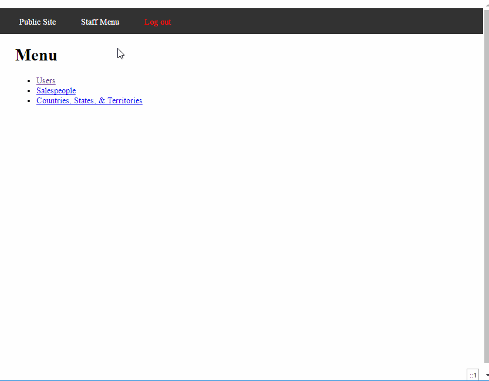

# Project 6 - Globitek Authentication and Login Throttling

Time spent 5 hours spent in total

## User Stories

The following required functionality is completed

1. staffusersnew.php and staffusersedit.php
   [x]  Form with inputs for Password and Confirm Password
   [x]  Strong password requirements text

2. Data validations
   [x]  Returns an error if password or confirm_password are blank.
   [x]  Returns an error if password and confirm_password do not match.
   [x]  Returns an error if password is not at least 12 characters long.
   [x]  Returns an error if password does not meet character requirements.
   [x]  Returns any errors related to other validations already on the user.

3. Saving a user
   [x]  Encrypts the password
   [x]  Stores the password in the database

4. Login page
   [x]  Verify the correct password.
   [x]  Do not create a User Enumeration vulnerability.

5. If a user fails to log in
   [x]  Record the failed login for the first 5 attempts.
   [x]  Return a too many failed logins message after 5 attempts.
   [x]  Future attempts will show the number of minutes remaining in the lockout.
   [x]  After the lockout period, the failed logins count resets to 0.

6. After any successful login
   [x]  Set the failed_logins.count for the username to 0.

7. SQLi and XSS
   [x]  Do not introduce any SQLI Injection and Cross-Site Scripting vulnerabilities.

The following advanced user stories are optional

 Bonus Objective 1.
   [x]  Identify the subtle Username Enumeration weakness. Include a short description of how the code could be modified to be more secure below
   * ANSWER: The user enumeration weakness comes from having two seperate error messages when user's username wasn't found vs user's unername was found but the password was incorrect.
   * In this case, "Log in was not successful" vs "Log in was unsuccessful"
   * This can be fixed by having a common error message for both cases. In my code, they are adjusted to display only "Log in was not successful"

 Bonus Objective 2.
   [x]  User password validations only run when the password is not blank.
   [x]  `update_user` only encrypts and updates the password when the password is not blank.

 Bonus Objective 3.
   [x]  Create a new user using cost 10.
   [x]  Set bcrypt cost parameter to 11 (for both insert and update).
   [x]  Try to login with the cost 10 user.
   [x]  Briefly describe why login still works even after the cost is changed
    * Because the string returned by password_hash() also contains the algorithm, cost, and salt.

 Bonus Objective 4.
   [ ]  Add Previous password to publicstaffusersedit.php
   [ ]  Validate the previous password before allowing the password to be updated.
   [ ]  Require previous password only if new password is being updated (if also completing Bonus Objective 2).

 Advanced Objective 1.
   [ ]  Implement `password_hash()` on your own as `my_password_hash()`.
   [ ]  Implement `password_verify()` on your own as `my_password_verify()`.

 Advanced Objective 2.
   [ ]  Write `generate_strong_password()`
   [ ]  Add a suggestion for a 12-character strong password to the new and edit user pages.

## Video Walkthrough

Here's a walkthrough of implemented user stories

GIF created with [LiceCap](httpwww.cockos.comlicecap).

## Notes

I had a typo in one of my if-else statemet where I typed "else if" instead of "elseif". And due to php not recognizing that as an error, it took me a long time to figure out that it was a typo issue.

## License

    Copyright [2017] [Jinwoo Yom]

    Licensed under the Apache License, Version 2.0 (the License);
    you may not use this file except in compliance with the License.
    You may obtain a copy of the License at

        httpwww.apache.orglicensesLICENSE-2.0

    Unless required by applicable law or agreed to in writing, software
    distributed under the License is distributed on an AS IS BASIS,
    WITHOUT WARRANTIES OR CONDITIONS OF ANY KIND, either express or implied.
    See the License for the specific language governing permissions and
    limitations under the License.
198.58.125.217